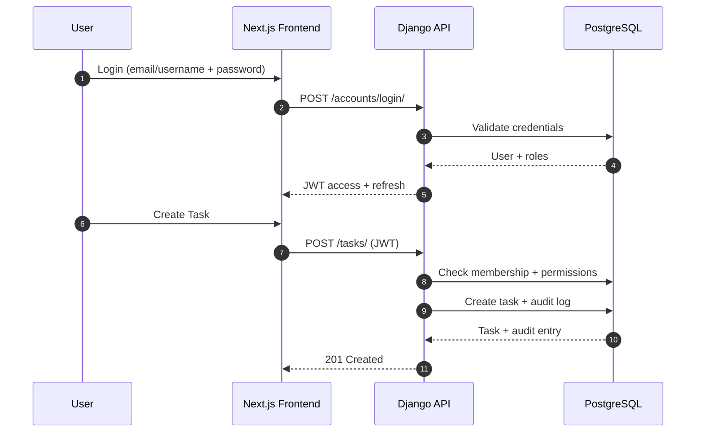

# NavFlow

Live link: https://nav-flow.vercel.app

A multi-tenant project and task management platform built with a Django + DRF backend and a Next.js frontend. NavFlow is intentionally backend-heavy, showcasing deep work in domain modeling, permissions, auditability, and multi-tenant security while also delivering a polished, modern UI.

## Why This Project Stands Out
NavFlow is more than a CRUD app:
- Multi-tenant architecture with strict org/project scoping and role-based access control at multiple layers
- Backend-heavy business logic implemented in service layers, permission classes, and model constraints
- Auditability and compliance features including audit logs and soft deletes
- Real-world collaboration features: invitations, notifications, comments, mentions, and time tracking

If you want to evaluate my backend skills, this project is built to make them easy to see.

## Tech Stack
Backend
- Django 6 + Django REST Framework
- PostgreSQL (Render-ready config)
- JWT auth (SimpleJWT)
- drf-spectacular (OpenAPI / Swagger)
- django-filter (filtering + search)
- Whitenoise (static files)

Frontend
- Next.js 16
- React 19
- Tailwind CSS v4
- Zustand (auth/store)
- Axios (API client)

Deployment
- Frontend: Vercel
- Backend: Django (Render deployment config included)

## Multi-Tenant Architecture (Core Design)
NavFlow is a multi-tenant system where each tenant is an Organization. Every data access path is scoped to the organization and the users membership:

- Organizations own projects and define tenant boundaries
- Memberships define org-level roles (Owner/Admin/Moderator/Member)
- Projects belong to exactly one organization and have their own ProjectRole memberships
- Org-level permissions can be customized per role (who can create tasks, manage labels, invite members, etc.)
- Querysets are filtered by membership so users only see data from their organizations

This architecture is enforced across models, viewsets, serializers, and permission classes.

## Backend Features
Identity and Auth
- Custom User model (email login + unique username)
- JWT auth with access/refresh tokens
- Login supports email or username
- Profile management and secure account deletion

Organization and Tenancy
- Create/manage orgs
- Role-based org memberships
- Invite by username or email
- One owner per org (enforced in model validation)
- Org-wide permission settings (per-role toggles)

Projects and Roles
- Projects scoped to orgs
- Project membership roles (Owner/Admin/Moderator/Member)
- Role-based project operations and membership management
- Constraints to prevent cross-org membership leakage

Tasks (Backend-Heavy Logic)
- Soft delete support (deleted_at)
- Time tracking with timers (start/pause/stop/reset)
- Sections (custom workflow stages)
- Labels with colors/icons (default, org-wide, or project-specific)
- Assignments, priority, due dates, and ordering

Collaboration
- Comments with @mentions
- Notifications for assignments, comments, invitations
- Focus Mode (personal task focus list + notes)
- Audit logging for all critical actions

Audit and Compliance
- Audit log model with full system traceability
- Pagination, filtering, and ordering
- Activity view in frontend

## Frontend Features
- Dashboard overview (projects, tasks, orgs, completion rate)
- Organization management + role permissions UI
- Project management with members and role updates
- Task board with filters, sections, and timers
- Focus mode for personal productivity
- Activity timeline with filters
- Settings (profile, theme, notifications, account deletion)

## API Overview

Auth and Accounts
- POST /accounts/register/
- POST /accounts/login/
- POST /accounts/logout/
- POST /accounts/token/refresh/
- GET /accounts/user/
- GET/PATCH /accounts/profile/
- POST /accounts/delete-account/
- GET/POST /accounts/notifications/

Organizations (Multi-Tenant)
- GET/POST /orgs/
- GET /orgs/{id}/members/
- POST /orgs/{id}/invite/
- POST /orgs/{id}/update_role/
- POST /orgs/{id}/permissions/update/
- GET /orgs/{id}/permissions/
- GET /orgs/invitations/

Projects and Tasks
- GET/POST /projects/
- GET /projects/{id}/members/
- POST /projects/{id}/add_member/
- POST /projects/{id}/update-member-role/

- GET/POST /tasks/
- POST /tasks/{id}/start_timer/
- POST /tasks/{id}/pause_timer/
- POST /tasks/{id}/stop_timer/
- POST /tasks/{id}/reset_timer/
- POST /tasks/reorder/

Labels, Sections, Comments, Focus
- GET/POST /sections/
- GET/POST /labels/
- GET/POST /comments/
- GET/POST /focus/

System
- GET /health/
- GET /api/docs/ (Swagger)
- GET /api/redoc/

## Local Development

Backend
```bash
python -m venv .venv
.venv\Scripts\activate
pip install -r requirements.txt
python manage.py migrate
python setup_test_users.py
python manage.py runserver
```

Frontend
```bash
cd frontend-nextjs
npm install
npm run dev
```

## Deployment
Frontend (Vercel)
- Config in vercel.json

Backend (Django)
- Render config in render.yaml
- Build command runs migrations
- Uses gunicorn for production

## System Design and Architecture
High-level architecture and data flow:

```text
                       +------------------------------+
                       |          End Users           |
                       +--------------+---------------+
                                      |
                                      | HTTPS
                                      v
                         +-------------------------+
                         |   Next.js Frontend      |
                         |   (Vercel / Local)      |
                         +-----------+-------------+
                                     | REST (JWT)
                                     v
                         +-------------------------+
                         |   Django + DRF API      |
                         |   (Render / Local)      |
                         +-----------+-------------+
                                     |
                      +--------------+--------------+
                      |                             |
                      v                             v
         +-------------------------+     +-------------------------+
         | PostgreSQL Database     |     |  Static + Media Assets  |
         | (Render / Local)        |     |  (Whitenoise / CDN)      |
         +-------------------------+     +-------------------------+
```

### Mermaid Diagram (GitHub Renderable)
```mermaid
flowchart TD
  U[End Users] -->|HTTPS| F[Next.js Frontend
(Vercel / Local)]
  F -->|REST + JWT| A[Django + DRF API
(Render / Local)]
  A -->|ORM| DB[(PostgreSQL)]
  A -->|Static| S[Whitenoise / CDN]

  subgraph Tenancy[Multi-Tenant Boundary]
    O[Organization]
    M[Memberships + OrgPermissions]
    P[Projects + ProjectRoles]
    T[Tasks + Sections + Labels]
    N[Notifications + Audit Logs]
    O --> M --> P --> T --> N
  end

  A --> Tenancy
```

### Request Flow (Sequence Diagram)


Notes
- All querysets are scoped by membership to enforce tenant isolation
- Role and permission checks are enforced at model, service, and API layers

## Backend Engineering Highlights
- Multi-tenant data isolation via org/project scoping
- Role-based permission system at org + project levels
- Service-layer business logic for tasks/projects (not just views)
- Audit log pipeline for traceability
- Soft deletes and data preservation for tasks/users
- Structured notification system with actionable invites

## Repo Structure
```
accounts/          # Custom user model, auth, notifications
orgs/              # Multi-tenant orgs, memberships, permissions
projects/          # Projects, tasks, audit logs, labels, sections
navflow/           # Django settings + URLs
frontend-nextjs/   # Next.js app
```